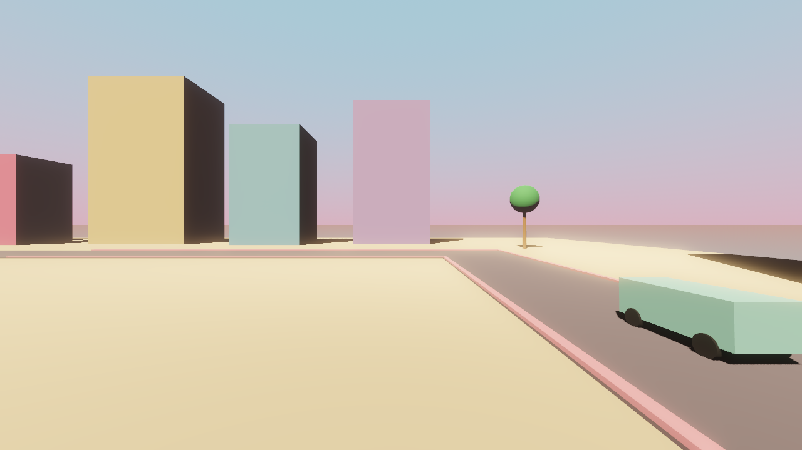
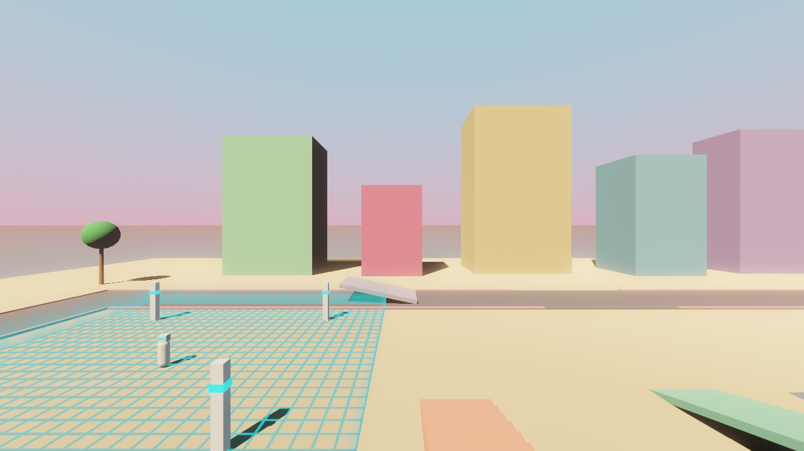

# VIBE CITY

VIBE CITY is an open-world game about cheerful AI agents politely occupying a pastel Miami, district by district, while you play the human resistance reclaiming streets, vehicles, and territory.

| | |
|---|---|
|  |  |
| Driving the ring road | Agent-converted territory |

## Requirements

- Godot 4.6+

## How to Run

Open the project in Godot and press play, or run this from the repo root:

```bash
godot
```

## Controls

| Input | Keyboard and Mouse | Gamepad |
|---|---|---|
| Move | WASD | Left stick |
| Look | Mouse look | Right stick |
| Jump | Space | A |
| Sprint | Shift | L3 |
| Enter / exit vehicle | E | Y |
| Throttle / brake (in car) | W / S | Left stick |
| Handbrake (in car) | Space | B |
| Look behind (in car) | C | R3 |
| Release mouse | Esc | - |

## How to Check

```bash
./check.sh
```

## Contributing

Read `docs/ROADMAP.md` and `docs/ARCHITECTURE.md` before changing the project. Keep one concern per PR, and make sure `./check.sh` passes before handing off work.
